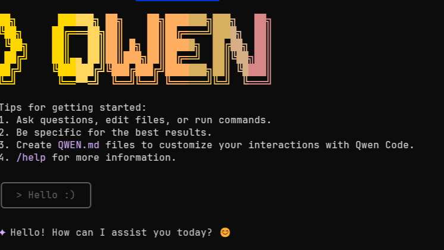
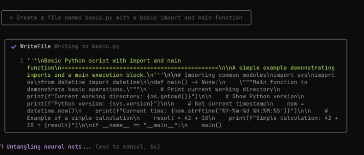

---

🤖⚡ **Local agents, fast responses, no API bills. Qwen3-4B is your new best friend.**

✍️ It’s been a while since I posted here, but I wanted to share something quick and practical.

🚀 **Want to use the `Qwen3-4B-Instruct-2507` model locally as if it were OpenAI? It's easier than you'd think.**

Thanks to tools like **LM Studio** and **Qwen Code CLI**, you can run the model on your machine and call it using an OpenAI-compatible API — no need to change your existing codebase.

---

# 🧩 **What do you need?**



1. **Install [LM Studio](https://lmstudio.ai)** and load the model `Qwen/Qwen3-4B-Instruct-2507`.

2. **Start the model server in LM Studio**
   Make sure it's served at:
   `http://127.0.0.1:1234/v1`

3. **Install Qwen Code CLI globally:**

   ```bash
   npm install -g @qwen-code/qwen-code@latest
   qwen --version  # Verify installation
   ```

4. **Create a `.env` file** in your working directory with:

   ```env
   OPENAI_API_KEY=lm-studio
   OPENAI_BASE_URL=http://127.0.0.1:1234/v1
   OPENAI_MODEL=qwen3-4b-instruct-2507
   ```

---

💡 **Why is this useful?**

* It allows you to interact with the model **directly from your terminal**
* Compatible with tools like `LangChain`, `LlamaIndex`, or `Autogen`
* **No cloud required** — you stay fully offline

🎮 **And yes — it runs on modest GPUs** (8–12 GB VRAM). Ideal for laptops and local dev setups.

---

✅ **Great for:**

* 🧪 Testing local agents
* 🔒 Private, offline workflows
* ⚙️ Rapid development without API costs

---



If you're building agents, exploring LLMs, or just want to keep your workflows local, this setup is a great starting point.

🛠️ Want example code or more advanced setups (multi-agents, LangGraph, etc.)? Just let me know.

\#Qwen #LLM #OpenSourceAI #LangChain #LMStudio #QwenCode #LocalLLM #SmallGPUs #DeveloperTools

---
